# PercepTrack3D

**KITTI 카메라 + LiDAR 로 도로 객체를 검출하고, 캘리브레이션된 점군으로 3D 위치를 추정하고, 시간에 따라 추적하고, 정량 평가한 뒤, ROS2 노드와 C++ 컴포넌트로 패키징한 재현 가능한 3D 인식 파이프라인.**

> 한 문장 문제 정의: *2D 검출기가 이미지에서 찾은 물체가 3D 공간의 어디에 있고, 프레임 사이에서 같은 물체인지 알아내라.*

<p align="center">
  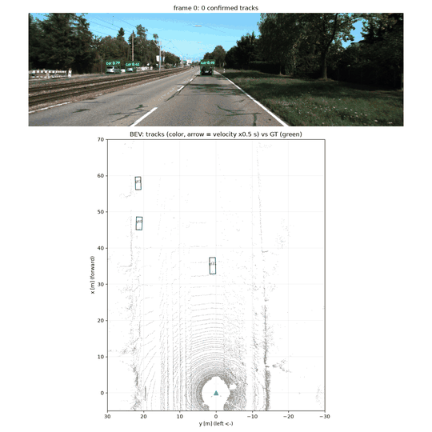
</p>
<p align="center"><sub><code>python scripts/run_system.py</code> 한 명령의 출력. 위: 카메라 이미지에 YOLO 2D 박스와 칼만 트랙 ID·거리. 아래: LiDAR BEV 위에 트랙(색), 속도 화살표, 궤적, GT(초록). 297프레임 중 앞 150프레임, 실시간 속도.</sub></p>

<table align="center"><tr>
<td align="center">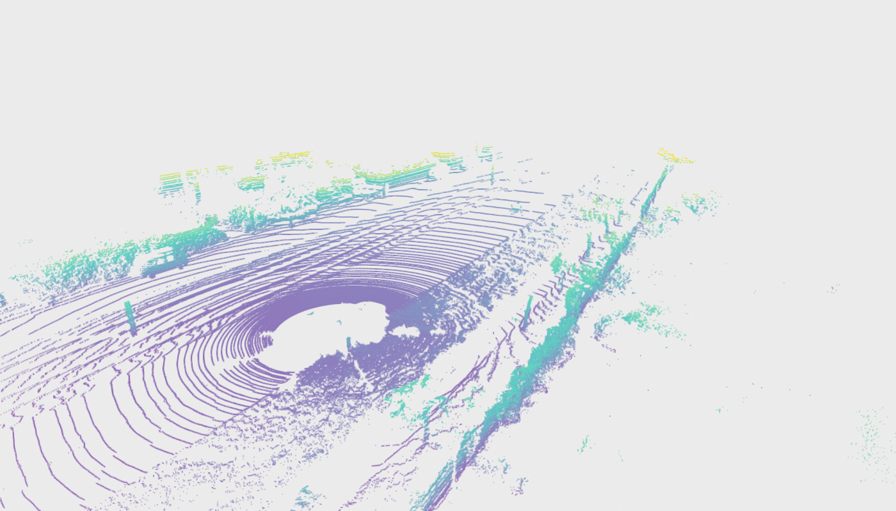<br><sub>Velodyne HDL-64E 점군 (프레임 0, 3D)</sub></td>
<td align="center">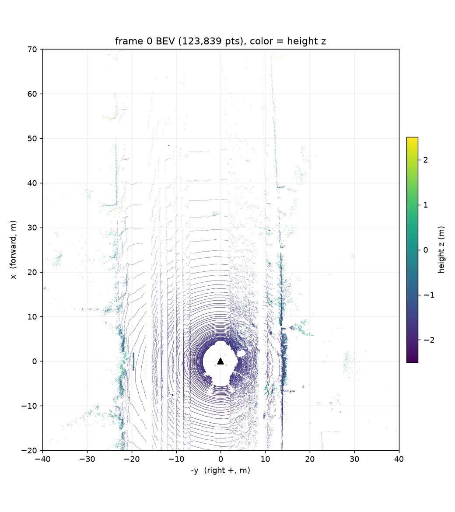<br><sub>같은 프레임 BEV (x 전방 ↑, y 좌 ←, 색 = 높이 z)</sub></td>
</tr></table>
<p align="center"><sub>LiDAR 한 프레임의 실제 값: <code>(123839, 4) float32</code> = [x, y, z, reflectance]. x −78.9~78.1 m, y −69.1~71.4 m, z −3.5~2.9 m (지면 ≈ −1.7 m, 센서 높이 1.73 m), r 0~0.99. 첫 점 = (48.37, 11.55, 1.89, 0.10).</sub></p>


## 시스템 구성

```text
KITTI raw (image_02 PNG, velodyne .bin, calib txt, tracklet_labels.xml)
        │
        ├─ Phase 1  data/kitti_loader.py        이미지 (H,W,3) BGR / 점군 (N,4) [x,y,z,r]
        ├─ Phase 2  geometry/calibration.py     T_velo_to_cam, R_rect_00, P_rect_02  → P_velo_to_img (3×4)
        ├─ Phase 3  geometry/projection.py      Velodyne → rect → pixel (u,v), depth>0, 이미지 안
        ├─ Phase 4  detection/detector.py       YOLOv8n (COCO 사전학습, CPU) → Detection2D(class, conf, xyxy)
        ├─ Phase 5  fusion/frustum_fusion.py    박스 안 점 → 하위 30% 깊이 → 중앙값 중심   (변형 A, raw)
        ├─ Phase 6  fusion/point_filters.py     ROI → 지면 RANSAC → frustum → DBSCAN → 표면→중심 오프셋 → AABB  (변형 B)
        ├─ Phase 7  tracking/kalman_tracker.py  등속 칼만 필터 + 마할라노비스 게이트 + 헝가리안 + 생명주기  (변형 C)
        ├─ Phase 8  evaluation/*.py             tracklet GT 파싱, BEV 2 m 매칭, 오차/IoU/PR/IDSW, 런타임
        ├─ Phase 9  ros2_ws/perceptrack3d_ros   player → detector → projection → fusion → tracker → viz, RViz2
        └─ Phase 10 cpp/                        투영·ROI·frustum 을 C++17 + Eigen + pybind11 로, 수치 일치 검증
```

모든 3D 결과의 기준 좌표계는 **Velodyne** (x 전방, y 좌, z 상, m) 이다. tracklet GT 도 같은 프레임이라 변환 없이 비교하고, ROS REP-103 과도 일치한다. 좌표계 4종과 변환 체인은 [docs/architecture.md](docs/architecture.md), 그림은 아래.

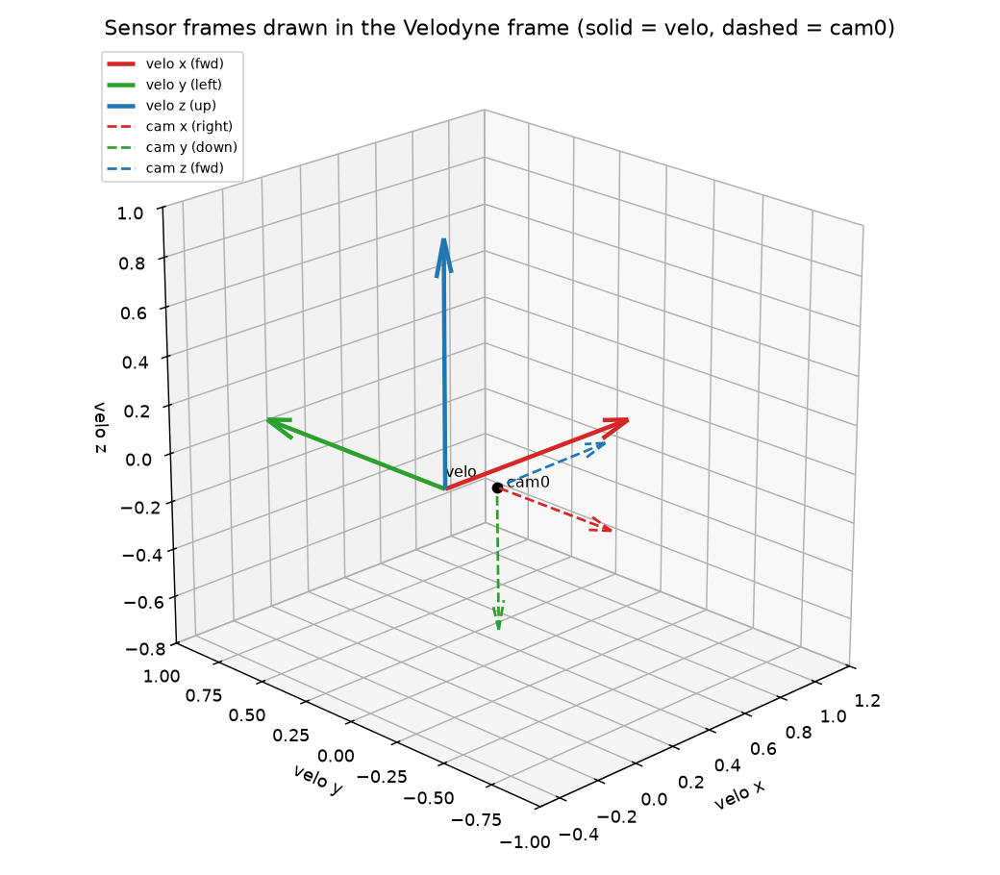

## 데이터

`2011_09_26_drive_0015_sync` (297 프레임, 10 Hz), 왼쪽 컬러 카메라 `image_02` (1242×375), Velodyne HDL-64E (~123k 점/프레임), tracklet 36개 (Car 33, Van 1, Truck 1, Cyclist 1). 데이터셋은 저장소 밖 `/home/ingon/datasets/KITTI/raw` 에 두고, 경로와 모든 파라미터는 [configs/kitti.yaml](configs/kitti.yaml) 한 곳에서만 정의한다.

## 설치와 재현

```bash
# Ubuntu 24.04 (WSL2), Python 3.12.3. 버전은 requirements.txt 에 고정.
python3 -m venv .venv && . .venv/bin/activate
pip install --isolated torch torchvision --index-url https://download.pytorch.org/whl/cpu
pip install --isolated --index-url https://pypi.org/simple -r requirements.txt -e .

python -m pytest -q                                   # 단위 테스트 (파서·변환·투영·할당·융합·메트릭)
python scripts/run_detection.py                       # Phase 4: outputs/phase4/detections.json + runtime.md
python scripts/run_pipeline.py --variant raw          # Phase 5: outputs/phase5/objects_raw.json
python scripts/run_pipeline.py --variant clustered    # Phase 6: outputs/phase6/objects_clustered.json
python scripts/run_pipeline.py --variant tracked      # Phase 7: outputs/phase7/tracks.json + 궤적 그림
python scripts/evaluate.py                            # Phase 8: outputs/phase8/results.md, plots/, runtime.md
python scripts/run_system.py                          # 전체 통합: 로드→YOLO→융합→추적→시각화(mp4)→평가, outputs/system/
python scripts/run_system.py --view3d --show          # + LiDAR 3D 뷰 창 (점군 + 3D 박스), outputs/system/lidar3d.mp4
scripts/build_cpp.sh && python scripts/benchmark_projection.py   # Phase 10
scripts/ros2_demo.sh                                  # Phase 9 (ROS2 Jazzy 필요)
jupyter nbconvert --to notebook --execute --inplace notebooks/0*.ipynb   # 학습 노트북 재실행
```

주요 버전: numpy 2.5.2, OpenCV 5.0, Open3D 0.19, torch 2.14 (CPU), ultralytics 8.4, scipy 1.18. 하드웨어: i7-14700K (28 스레드), 31 GB RAM, GPU 미사용.

## 결과

### Phase 3 — LiDAR → 이미지 투영
프레임 0: 123,839 점 → 카메라 앞 61,787 → 이미지 안 19,192 점. 도로면(노랑, 4 m)이 멀어지며(보라, 70 m) 앞차·주차 차량·가로수 윤곽과 정렬된다. 카메라 뒤 점을 depth>0 로 거르지 않으면 19,054 점이 가짜 픽셀로 찍힌다(노트북 03 실패 사례).

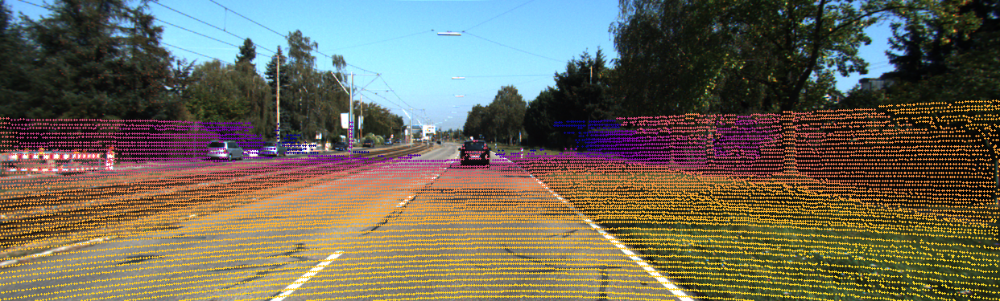

### Phase 4 — 2D 검출 (YOLOv8n, COCO 사전학습, 학습 없음)
297 프레임 1,325 검출 (car 1254, truck 37, person 23, bus 10, bicycle 1). CPU 추론 중앙값 **13.8 ms** (72 FPS, warm-up 제외, letterbox+순전파+NMS). COCO↔KITTI 라벨은 1:1 이 아니다(car↔Car/Van, person+bicycle↔Cyclist). 실패 사례 5종(원거리 소형, Cyclist 미검출, truck+bus 이중 검출, 바리케이드 오검출, 잘린 객체)은 [outputs/phase4/failures/README.md](outputs/phase4/failures/README.md).

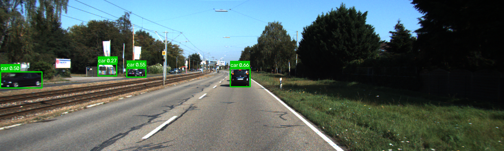

### Phase 5–6 — 카메라–LiDAR 융합과 3D 위치
2D 박스 안 점(색칠)과 추정 깊이. 박스 안에는 뒤쪽 배경 점이 섞이므로 평균 대신 하위 30% 백분위 깊이 ± 1.5 m 밴드의 중앙값을 쓴다(변형 A). 변형 B 는 ROI → 지면 RANSAC → DBSCAN 으로 전경 덩어리를 고르고, LiDAR 가 보이는 면만 찍는 **표면 편향**을 시선 방향 오프셋으로 보정한다.

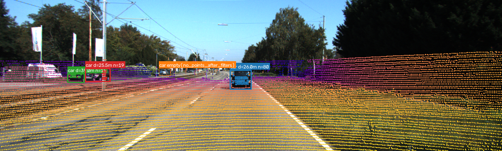
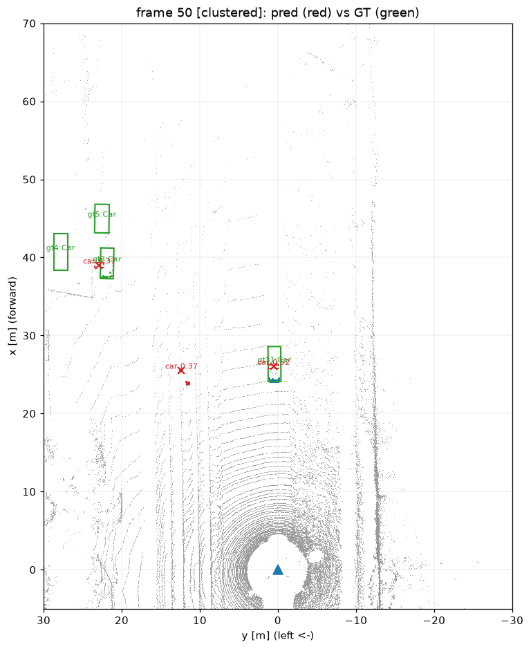

### Phase 7 — 다중 객체 추적 (등속 칼만 필터 + 헝가리안)
53개 확정 트랙 vs GT tracklet 36개, 프레임당 평균 3.9 트랙, ID 스위치 9. 앞차(gt31)는 단일 ID 로 297 프레임 유지되고, 좌측 차선의 원거리 주차 차량 열은 검출이 끊겨 ID 가 여러 개로 단절된다(한계).

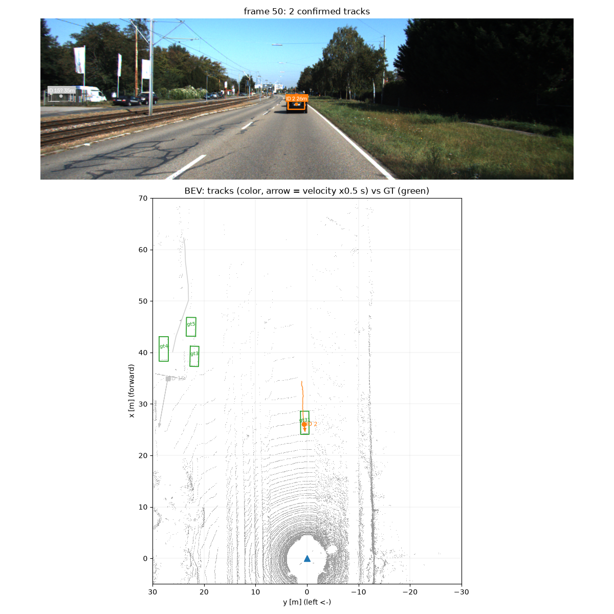
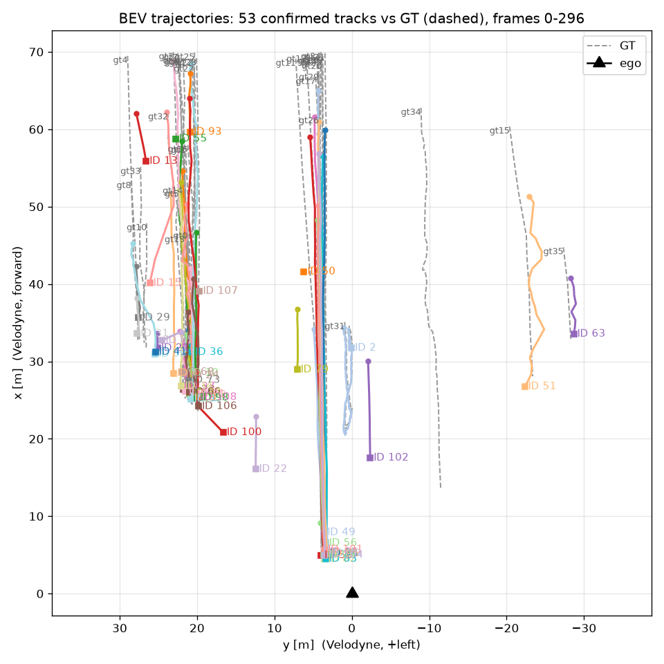

### Phase 8 — 정량 평가 (기준선 vs 개선)
GT = tracklet 중 카메라 FOV 안, x ≤ 70 m, Car/Van/Truck/Cyclist (1,394 박스). 매칭 = BEV 중심 거리 2 m 헝가리안 1:1. `scripts/evaluate.py` 한 명령으로 재현되며 전체 표·거리 구간·클래스·플롯 6장·무효 비교 목록은 [outputs/phase8/results.md](outputs/phase8/results.md).

| 변형 | 재현율 | 정밀도 | F1 | MOTA | BEV 오차 median | 깊이 bias | IDSW / 단절 |
|---|---|---|---|---|---|---|---|
| A: 2D 박스 + raw LiDAR 통계 | 0.45 | 0.53 | 0.48 | 0.05 | 1.48 m | −1.29 m | – |
| B: 2D 박스 + 필터/클러스터 + 표면 오프셋 | **0.66** | **0.84** | **0.74** | **0.53** | **0.56 m** | −0.30 m | – |
| C: B + 칼만 추적 (확정 트랙, coasting 포함) | 0.65 | 0.78 | 0.71 | 0.46 | 0.56 m | −0.33 m | 9 / 11 |
| C, coasting 제외 (참고) | 0.61 | 0.91 | 0.73 | 0.54 | 0.55 m | −0.34 m | – |

- **거리 구간별 재현율 (A / B / C)**: 0–20 m 0.76 / 0.81 / 0.80, **20–40 m 0.35 / 0.86 / 0.87**, 40–70 m 0.49 / 0.50 / 0.46. B 의 이득은 20–40 m 에 집중되고(표면 오프셋 효과), 40 m 이상은 셋 다 같다(640 px 검출기 한계).
- **Ablation**: B 에서 표면 오프셋만 끄면 BEV 오차 1.39 m 로 A 와 같다. 개선의 대부분은 "LiDAR 는 뒷면만 본다" 를 보정한 한 줄이고, 클러스터링은 정밀도를 올린다.
- **추적**: GT tracklet 36개를 53 ID 로 추적, MT/PT/ML = 13/19/4. IDSW 9건은 전부 좌측 차선 원거리 주차 차량. 앞차(gt31)는 ID 하나로 297 프레임 전부 유지.
- **BEV IoU** (B/C, AABB vs 회전 GT): 평균 0.23, 0–20 m 0.45 → 40–70 m 0.20. 원거리 크기 추정은 신뢰할 수 없어 중심 오차와 함께 읽어야 한다.

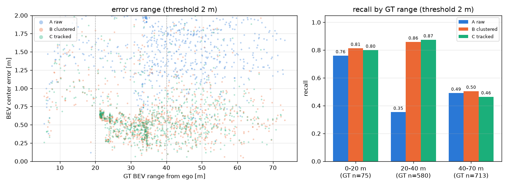
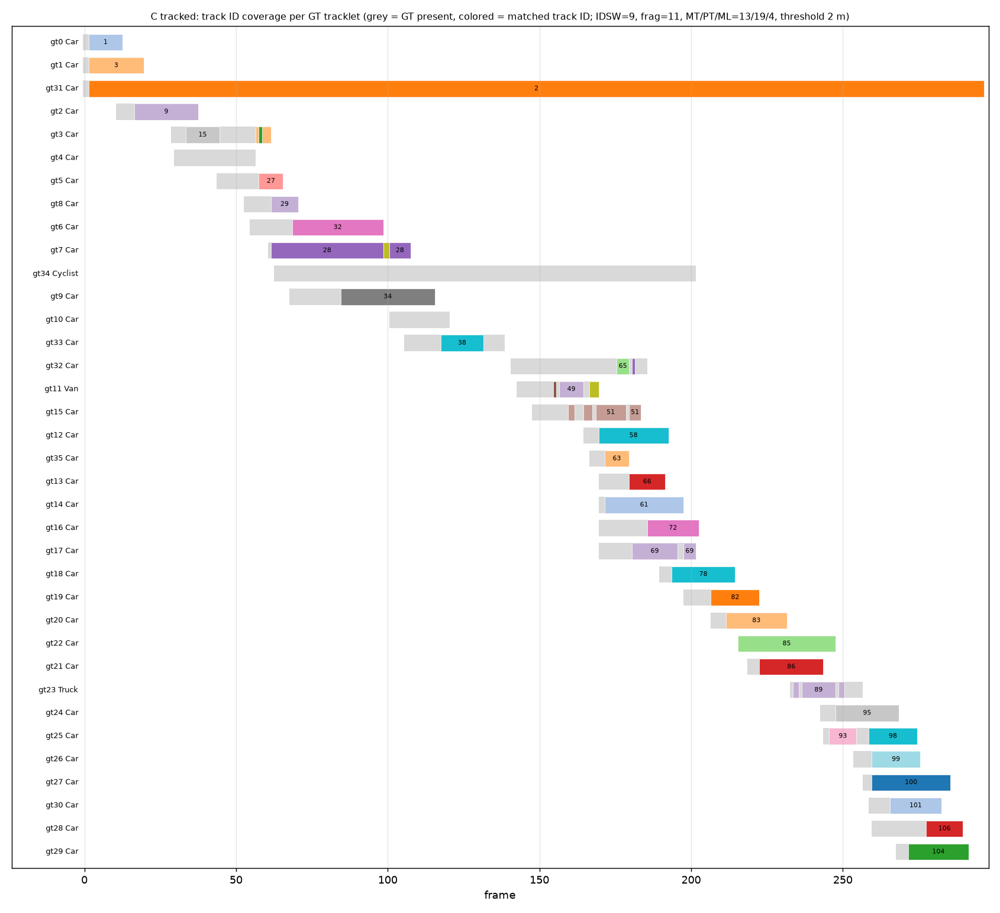

GT 를 LiDAR BEV 에 겹쳐 좌표 규약(바닥 중심 + h/2, [l,w,h], yaw=rz, Velodyne 프레임)을 검증한 그림:

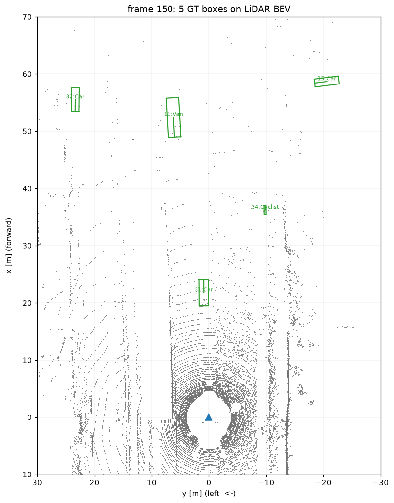

### 런타임 (i7-14700K, 단일 프로세스 CPU, 297 프레임, 프레임당 중앙값 ms, load avg 1.6~2.6)
| 단계 | A raw | B clustered | C tracked |
|---|---|---|---|
| YOLOv8n 검출 (phase4 측정 인용) | 13.8 | 13.8 | 13.8 |
| 로드 (PNG + bin) | 7.3 | 7.7 | 7.8 |
| 투영 | 2.6 | 1.9 | 2.0 |
| ROI + 지면 RANSAC | – | 7.0 | 7.9 |
| frustum + DBSCAN + 박스 | 0.5 | 1.4 | 1.5 |
| 추적 | – | – | 0.25 |
| **end-to-end** | **25.1 (40 FPS)** | **33.2 (30 FPS)** | **35.0 (29 FPS)** |

10 Hz 센서 대비 여유가 있다. 측정 방법·load average·p95 는 [outputs/phase8/runtime.md](outputs/phase8/runtime.md).

### Phase 9 — ROS2 Jazzy
`ros2_ws/src/perceptrack3d_ros` (ament_python, 노드 6개, launch, params, rviz). 파이프라인 모듈을 그대로 import 하고, 타임스탬프는 `stamp = frame_id / rate_hz` 로 결정적으로 만들어 모든 하위 노드가 프레임 번호를 복원한다.

```text
kitti_player_node ──/kitti/image_raw (Image, camera_02)─────────┬─▶ detector_node ──/perceptrack3d/detections_2d (Detection2DArray)─┐
                  ──/kitti/velodyne_points (PointCloud2, velodyne)┼─▶ lidar_projection_node ──/perceptrack3d/projection_image         │
                  ──/kitti/camera_info (CameraInfo)              └─▶ fusion_node ◀──────────────────────────────────────────────────┘
                  ──/tf_static: base_link → velodyne → camera_02        │ /perceptrack3d/objects_3d (Detection3DArray, frame_id=velodyne) + markers_objects
                                                                        ▼
                                                           tracker_node ──/perceptrack3d/tracks (Detection3DArray) + markers_tracks (CUBE/TEXT/LINE_STRIP)
                                                                        ▼
                                                           visualization_node ──/perceptrack3d/annotated_image  →  RViz2 (rviz/perceptrack3d.rviz)
```

검증 결과 ([outputs/phase9/verification.md](outputs/phase9/verification.md), `scripts/ros2_verify.sh` 로 재현):
- 10 Hz 재생에서 detections_2d / objects_3d / tracks 모두 10.0 Hz 발행. visualization_node 가 입력 4개의 stamp 일치를 매 프레임 검사해 750/750 일치. objects_3d·tracks 의 frame_id 는 전부 `velodyne`.
- TF: `tf2_echo camera_02 velodyne` 의 translation 이 캘리브레이션 `T_velo_to_rect` 와 일치(행렬 복원 오차 6.7e-16). base_link → velodyne 높이 1.73 m.
- 프레임 손실: 기본 rmw_fastrtps 는 297 프레임 중 5개 누락, rmw_cyclonedds 는 0개 → `scripts/ros2_demo.sh` 는 환경변수가 없을 때 CycloneDDS 를 기본으로 쓴다. 셸 프로필이 Fast DDS 를 명시한 환경에서는 `RMW_IMPLEMENTATION=rmw_cyclonedds_cpp scripts/ros2_demo.sh` 로 실행한다. OMP/torch 스레드를 제한하지 않으면 노드끼리 코어를 다퉈 10 Hz 를 못 지킨다(문서화).
- rosbag2 (mcap) 30 프레임 기록·`ros2 bag info` 확인.

실행: `scripts/ros2_demo.sh` (venv 의 colcon 으로 빌드해 노드 shebang 이 venv python 을 가리키게 한다). RViz2 는 `use_rviz:=true`.

### Phase 10 — C++ 최적화 비교
프로파일(`scripts/profile_projection.py`)로 고른 세 함수(투영, ROI 마스크, K개 박스 frustum 마스크)만 C++17 + Eigen + pybind11 로 옮겼다. (N,4) float32 를 `Eigen::Ref` + stride 로 복사 없이 읽고, 결과는 capsule 로 넘겨 numpy 가 복사 없이 본다. 20 프레임에서 mask 완전 일치, uv 최대 차이 0.0 (gtest 9, pytest 13).

| 함수 (median, 프레임 20장 × 30회) | Python (numpy) | C++ | 배수 |
|---|---|---|---|
| 투영 (123k 점) | 3.7 ms | 0.38 ms | 9.7× |
| ROI 마스크 | 1.3 ms | 0.19 ms | 7.2× |
| frustum (투영 1회 + 박스 4.5개) | 4.4 ms | 0.70 ms | 6.2× |

정직한 해석: 이득은 산술이 아니라 numpy 가 매 호출 만드는 10 MB 이상의 임시 배열 제거에서 온다. 파이프라인 전체로는 프레임당 약 4 ms 절약(≈28 → 24 ms)이며 로드와 YOLO 는 그대로다. 상세: [outputs/phase10/benchmark.md](outputs/phase10/benchmark.md).

## 실패 사례와 한계
- **검출**: COCO 에 Cyclist 가 없어 이 시퀀스 Cyclist GT 의 3% 만 잡힌다. 640 letterbox 로 40 m 이상 차량이 10 px 대가 된다(imgsz 1280 이면 매칭률 75→87%, 시간 3배 — 옵션으로 기록).
- **융합**: 크기(size)는 35 m 이상에서 실제보다 훨씬 작게 나와 신뢰할 수 없다. 중심이 주 산출물이다. DBSCAN 의 largest 규칙이 배경 덩어리를 고르는 경우(frame 174)가 있다.
- **추적**: coasting 예측이 정밀도를 깎고, 원거리 주차 차량 열에서 ID 가 단절된다. 등속 모델은 자차 회전을 모른다(oxts 미사용).
- **평가**: GT 에 없는 주차 차량을 YOLO 가 잡아 정밀도가 실제보다 낮게 나온다. Pedestrian GT 는 0개라 보행자 성능은 말할 수 없다. 단일 시퀀스 297 프레임의 결과이므로 일반화 주장을 하지 않는다.

## 학습용 2차 노트북 (`notebooks_2nd/`)
`notebooks/`가 완성본 정답지라면, `notebooks_2nd/01~08`은 같은 결과를 **실무자가 검색해서 가져다 붙이는 방식**으로 다시 만든 학습본이다. 조각마다 검색어 → 출처(URL·라이선스) → 원문 발췌 → 우리 데이터 적용(`# CHANGED`) → 정답지와 수치 검증 순서로 되어 있고, 마지막에 조각을 이어 붙여 정답지와 같은 결과가 나오는지 확인한다. 가져온 원본(KITTI devkit, pykitti, frustum-pointnets, SORT, filterpy, AB3DMOT, nuScenes devkit, py-motmetrics, Open3D 튜토리얼 등)은 `notebooks_2nd/sources/`에 라이선스와 함께 두었다(`SOURCES.md`). 형식은 `notebooks_2nd/FORMAT.md`.

## 저장소 구조
```text
configs/kitti.yaml        모든 경로·파라미터
src/perceptrack3d/        data · geometry · detection · fusion · tracking · evaluation · visualization
notebooks/01~06           단계별 학습 노트북 (완성본, 실행 결과 포함)
notebooks_2nd/01~08       실무 방식(출처→원문→적용→검증) 재구성 학습 노트북 + sources/
tests/                    pytest (파서·변환·투영·할당·융합·메트릭·C++ 일치)
scripts/                  run_system(통합 한 파일) · run_detection · run_pipeline · evaluate · benchmark_projection · ros2_demo
cpp/                      C++17 라이브러리 + gtest + pybind11 모듈
ros2_ws/                  ROS2 Jazzy 패키지 perceptrack3d_ros (노드 6, launch, rviz)
docs/                     architecture · decisions · references · learning_notes · images
outputs/                  생성물 (git 제외, 스크립트로 재생성)
```

## 출처와 라이선스
- KITTI raw 데이터셋 (Geiger et al., IJRR 2013) — 비상업 연구용 CC BY-NC-SA 3.0. 데이터는 저장소에 포함하지 않는다.
- YOLOv8 가중치 (Ultralytics, AGPL-3.0) — 자동 다운로드, 저장소에 포함하지 않는다.
- 참고한 문서·논문 목록: [docs/references.md](docs/references.md). 설계 결정 기록: [docs/decisions.md](docs/decisions.md).
